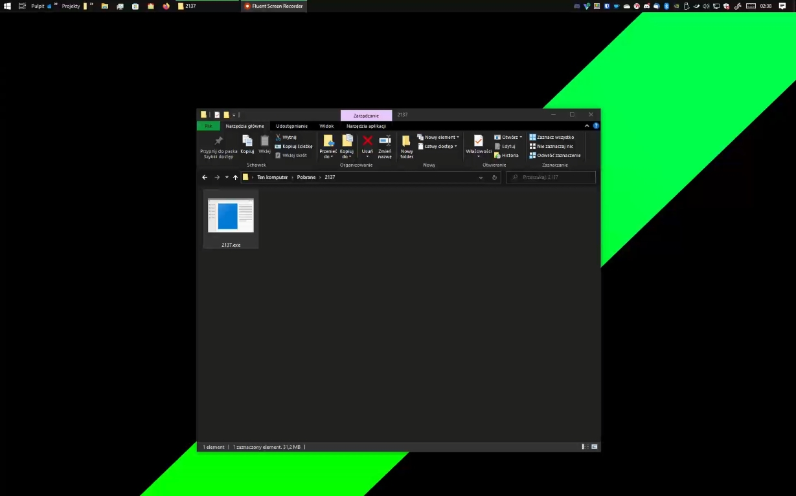

[Polish / Polski](./README-PL.md)

# 2137exe

Poorly made virus (a trojan actually) referring to JP2 memes.

It changes the wallpaper and plays a song in a loop.

# 🎬 Footage

[](https://kefir.tk/get/2137-prezentacja.mp4)

## 🔽 Download

Release [here](https://github.com/henior2/2137exe/releases/latest)

## 🧱 Build

I need to find a better tool for building than `iexpress` which i use right now, mostly because it has a high chance of getting detected by MS Defender.

In order to build it, first you need to run `build_deps.bat`. This will copy `wscript` (the VBS interpreter, soon it might not be needed anymore) to the `src/` directory.

If you just want to run the virus (to test of something) you can just run `src/install.vbs`.

If you want to make the binary `2137.exe` on your own, you need to use `iexpress` as mentioned before.

[Here's some crappy instructions i made, but it's in polish, i might translate it soon](.readme/instrukcja.png)

After building, it would be good to delete the icon and some metadata using [Resource Hacker](http://www.angusj.com/resourcehacker/).

## 📂 Project structure or something

```
2137exe
    |- .readme
        |- instrukcja.png
    |- lib - steal it
        |- sound.vbs
        |- wallpaper.vbs (sometimes doesn't work)
    |- src - it is what you think it is
        |- install.vbs - virus installation script
        |- 2137.vbs - main virus script, launched after installation
        |- wall.vbs - wallpaper changer working in background
        |- papaj.png - wallpaper
        |- barka.wav - played in a loop at max volume
    |- build_deps.bat - adds the rest of deps into src/
    |- README.md
    |- LICENSE
    |- .gitignore
```

## 📝 To do

- [ ] Rewrite `install` in some compiled language like Go
